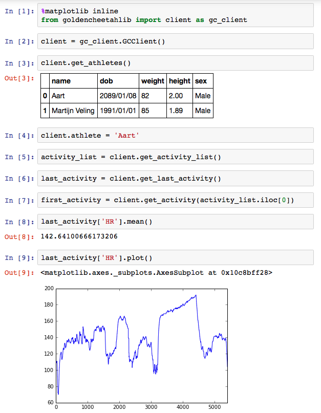

# GoldenCheetahLib
Python library that provides local access to activity data in GoldenCheetah.

**Important note**: This project is still in development and cannot be regarded 'stable' for now, but features will be added and bugs will be squashed. When the time is right, a stable version will be released.

## Introduction
Recently, GoldenCheetah got an embedded R Console (read about it [here](https://github.com/GoldenCheetah/GoldenCheetah/wiki/UG_Special-Topics_Working-with-R)) that got me wondering if something like this would be possible for Python as well. As it turnes out, it is: GoldenCheetah features a REST API that can be used to retrieve activity data. The API's functionality is basic but useful: 
- Get a list of all available athletes
- Get a list of all activities for an athlete
- Get athlete zones
- Get raw data for activities
- ...and some more

Full functionality can be found in the official documentation [here](https://github.com/GoldenCheetah/GoldenCheetah/wiki/UG_Special-Topics_REST-API-documentation).

The result is this project, *goldencheetahlib*. *goldencheetahlib* is basically a REST client that returns [Pandas Dataframes](http://pandas.pydata.org/pandas-docs/stable/generated/pandas.DataFrame.html.) with all your data.

## Requirements
- Python 3 (Python 2 support is not planned)
- All the libraries in requirements.txt installed (preferably in your virtualenv).
- GoldenCheetah >3.3 installed and running

## Getting started
First, make sure you meet the requirements. After that, clone this notebook in your project directory. If you have done this succesfully, these code snippets should get you started:
```python
%matplotlib inline
from goldencheetahlib import client as gc_client
```
```python
client = gc_client.GCClient()
```
Find the names of all available athletes:
```python
client.get_athletes()
```
Set the athlete name in the client:
```python
client.athlete = 'John Doe'
```
(This can also be done by initializing the client with GCClient(athlete='John Doe')

Now you can start getting your data from GoldenCheetah:
```python
activity_list = client.get_activity_list()
```
```python
last_activity = client.get_last_activity()
```
```python
first_activity = client.get_activity(activity_list.iloc[0])
```

Because every returned activity and activity_list is a Pandas Dataframe interacting with them is really easy:
```python
last_activity['HR'].mean()
last_activity['HR'].plot()
```

Try it out!

Example of output:



## License
The code in this repository is licensed under the [MIT License](http://choosealicense.com/licenses/mit/). GitHub [describes](http://choosealicense.com) this license as follows:
> The MIT License is a permissive license that is short and to the point. It lets people do anything they want with your code as long as they provide attribution back to you and don’t hold you liable.

My summary: Use this code for whatever you want, give me credit every single time and don't blame me if things go wrong.

## Contributing
Feel free to contribute to this project by [opening an issue](https://github.com/AartGoossens/goldencheetahlib/issues/new) or opening pull requests.
